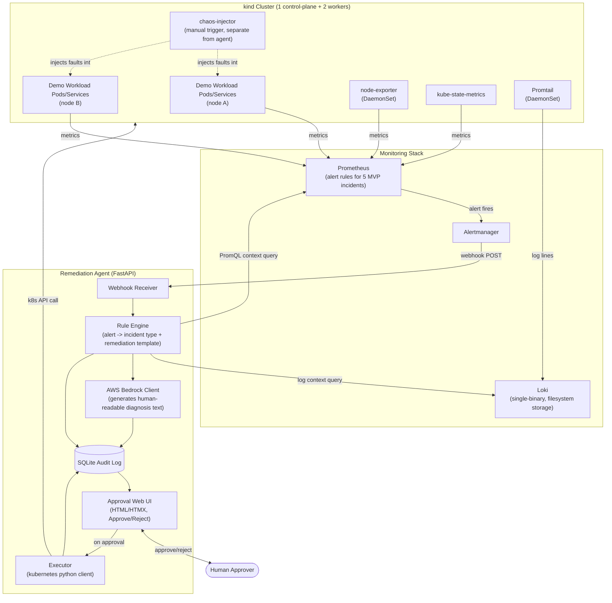
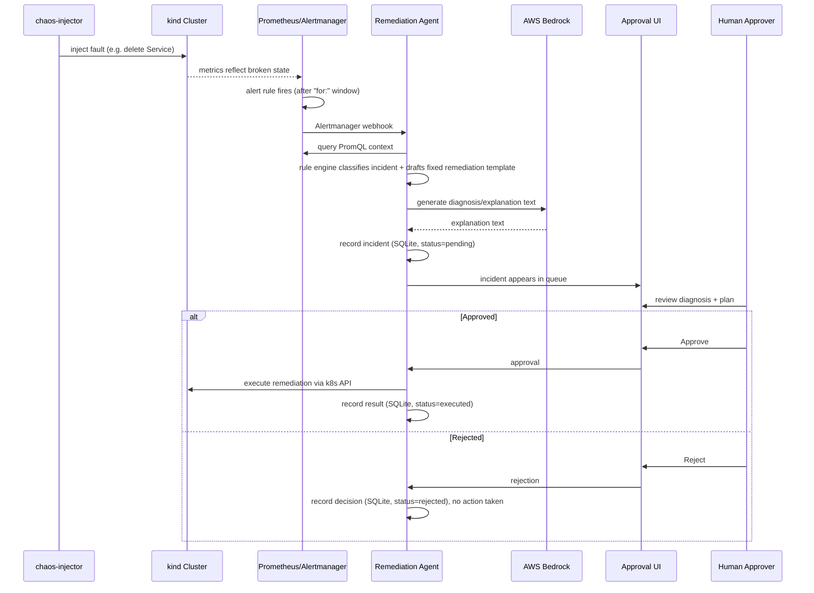
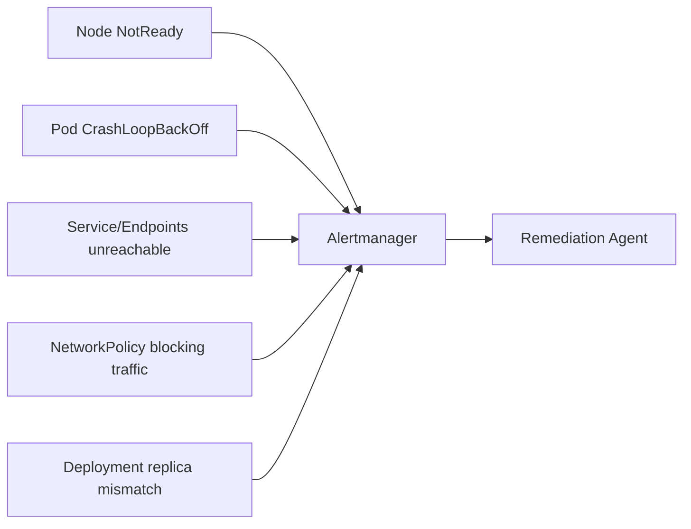

# Architecture Diagram

## System Overview

```mermaid
flowchart TB
    subgraph Cluster["kind Cluster (1 control-plane + 2 workers)"]
        direction TB
        W1["Demo Workload Pods/Services<br/>(node A)"]
        W2["Demo Workload Pods/Services<br/>(node B)"]
        NE["node-exporter<br/>(DaemonSet)"]
        KSM["kube-state-metrics"]
        PT["Promtail<br/>(DaemonSet)"]
        CI["chaos-injector<br/>(manual trigger, separate from agent)"]
        CI -.injects faults into.-> W1
        CI -.injects faults into.-> W2
    end

    subgraph Monitoring["Monitoring Stack"]
        PROM["Prometheus<br/>(alert rules for 5 MVP incidents)"]
        AM["Alertmanager"]
        LOKI["Loki<br/>(single-binary, filesystem storage)"]
    end

    subgraph AgentSvc["Remediation Agent (FastAPI)"]
        WH["Webhook Receiver"]
        RULE["Rule Engine<br/>(alert -> incident type + remediation template)"]
        BR["AWS Bedrock Client<br/>(generates human-readable diagnosis text)"]
        EXEC["Executor<br/>(kubernetes python client)"]
        AUDIT[("SQLite Audit Log")]
        UI["Approval Web UI<br/>(HTML/HTMX, Approve/Reject)"]
    end

    Human(["Human Approver"])

    W1 & W2 & NE & KSM -->|metrics| PROM
    PT -->|log lines| LOKI
    PROM -->|alert fires| AM
    AM -->|webhook POST| WH
    WH --> RULE
    RULE -->|PromQL context query| PROM
    RULE -->|log context query| LOKI
    RULE --> BR
    BR --> AUDIT
    RULE --> AUDIT
    AUDIT --> UI
    UI <-->|approve/reject| Human
    UI -->|on approval| EXEC
    EXEC -->|k8s API call| Cluster
    EXEC --> AUDIT
```

## Approval Sequence (per incident)

```mermaid
sequenceDiagram
    participant Inj as chaos-injector
    participant K8s as kind Cluster
    participant Prom as Prometheus/Alertmanager
    participant Agent as Remediation Agent
    participant Bedrock as AWS Bedrock
    participant UI as Approval UI
    participant Human as Human Approver

    Inj->>K8s: inject fault (e.g. delete Service)
    K8s-->>Prom: metrics reflect broken state
    Prom->>Prom: alert rule fires (after "for:" window)
    Prom->>Agent: Alertmanager webhook
    Agent->>Prom: query PromQL context
    Agent->>Agent: rule engine classifies incident + drafts fixed remediation template
    Agent->>Bedrock: generate diagnosis/explanation text
    Bedrock-->>Agent: explanation text
    Agent->>Agent: record incident (SQLite, status=pending)
    Agent->>UI: incident appears in queue
    Human->>UI: review diagnosis + plan
    alt Approved
        Human->>UI: Approve
        UI->>Agent: approval
        Agent->>K8s: execute remediation via k8s API
        Agent->>Agent: record result (SQLite, status=executed)
    else Rejected
        Human->>UI: Reject
        UI->>Agent: rejection
        Agent->>Agent: record decision (SQLite, status=rejected), no action taken
    end
```

## MVP Incident Coverage

```mermaid
flowchart LR
    A1["Node NotReady"] --> AM["Alertmanager"]
    A2["Pod CrashLoopBackOff"] --> AM
    A3["Service/Endpoints unreachable"] --> AM
    A4["NetworkPolicy blocking traffic"] --> AM
    A5["Deployment replica mismatch"] --> AM
    AM --> Agent["Remediation Agent"]
```
