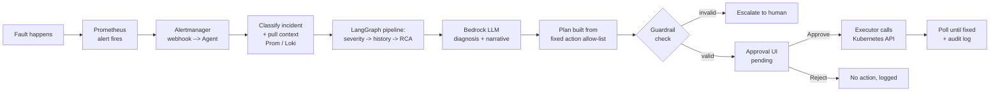

# Capstart — Kubernetes Incident Remediation Agent

A **human-in-the-loop AI agent** that watches a Kubernetes cluster, diagnoses incidents
the moment they're detected, proposes a fix, and only touches the cluster after a human
clicks **Approve**. Think of it as an SRE copilot: it does the triage legwork, but a
person always holds the trigger.

## What it does

When something breaks in the cluster (a pod crash-looping, a node going `NotReady`, a
service losing its endpoints, a bad `NetworkPolicy`, a broken rollout), the agent:

1. **Detects** it via a Prometheus alert.
2. **Classifies** the alert into a known incident type.
3. **Investigates** by pulling live metrics (Prometheus) and logs (Loki) as evidence.
4. **Diagnoses** root cause using an LLM (Amazon Bedrock/Nova), with a confidence score.
5. **Plans** a remediation — but the actual *action* always comes from a fixed,
   deterministic allow-list, never freely from the LLM.
6. **Guards** the plan with a rule-based check (right action, right target) before a
   human ever sees it.
7. **Waits for a human** to approve or reject in a web UI.
8. **Executes** the fix via the Kubernetes API only after approval, polls until the
   underlying problem clears, and logs everything.

Every step — alert payload, queries, LLM prompts/responses, decisions, and execution
results — is written to an audit trail, so any incident can be replayed and explained
after the fact.

## Why it exists (the problem)

- Manual triage of Kubernetes incidents is slow, repetitive, and inconsistent across
  responders.
- Fully autonomous "self-healing" is risky — nobody wants an LLM to run `kubectl delete`
  on production with no one watching.
- Most AIOps demos either fake the loop or skip the safety story entirely.

This project proves out a **middle ground**: LLM-assisted diagnosis and planning, but
with deterministic guardrails and a mandatory human approval gate, plus a full audit
trail — so the *speed* of automation doesn't come at the cost of *control*.

## The flow, with tools



| Stage | Tool / Tech |
|---|---|
| Cluster | `kind` (local Kubernetes, 1 control-plane + 2 workers) |
| Metrics & alerting | Prometheus, Alertmanager, kube-state-metrics, node-exporter, blackbox-exporter |
| Logs | Loki + Promtail |
| Orchestration | Python + FastAPI + **LangGraph** (state machine of diagnosis/planning nodes) |
| Diagnosis / narrative | AWS Bedrock (Amazon Nova) |
| Remediation | Kubernetes Python client, dispatched only post-approval |
| Audit trail | SQLite |
| Approval UI | FastAPI + HTML/HTMX |
| Fault injection (for demo) | Standalone scripts under `injector/`, kept separate from the agent |

## Where things live

| Path | Purpose |
|---|---|
| `agent/app/` | The FastAPI service: webhook receiver, LangGraph diagnosis/planning graph, executor, audit log, approval UI |
| `agent/app/graph/nodes/` | Each pipeline step (investigate, severity, historical, supervisor, rca, plan, guardrail, escalate) |
| `agent/app/remediation/templates.py` | The allow-listed remediation actions — the only actions the agent can ever execute |
| `cluster/`, `monitoring/` | `kind` cluster config and the full Prometheus/Loki monitoring stack manifests |
| `injector/` | Scripts that deliberately break things, for demoing/testing the pipeline |
| `scripts/` | One-command PowerShell workflow: `deploy.ps1`, `inject.ps1`, `status.ps1`, `teardown.ps1` |
| [plan.md](plan.md) | Design rationale, goals/non-goals, incident catalog |
| [diagram.md](diagram.md) | Full architecture + sequence diagrams |
| [agents.md](agents.md) | Deep dive on the LangGraph state machine and exact data flow between nodes |
| [instructions.md](instructions.md) | Step-by-step guide to stand up the cluster and run an incident end-to-end |

## Quick start

```powershell
cd project
./scripts/deploy.ps1        # stands up cluster + monitoring + agent
./scripts/inject.ps1 -Incident crashloop   # break something on purpose
```

Then open http://localhost:8000 to watch the incident land in the queue, review the
diagnosis, and approve or reject it. Full walkthrough in [instructions.md](instructions.md).

## Design principles that make this safe

- **No free-form LLM actions** — the LLM only ever names a title/narrative; the actual
  `action` + `target` executed against the cluster is validated against a fixed
  allow-list and the real alert data by a deterministic guardrail node.
- **Human approval is mandatory** — there is no code path where a remediation runs
  without an explicit `Approve` click, regardless of confidence score.
- **Everything is logged** — every SEND/RECV (Prometheus, Loki, Bedrock, Kubernetes
  API) is recorded per-incident for replay and post-incident review.

## Honest gaps / where this could grow next

- No latency/tracing instrumentation yet — timing each pipeline stage (and adopting
  something like LangSmith or OpenTelemetry) would make performance and LLM-call cost
  visible instead of inferred from logs.
- "Historical" incident matching is a simple similarity lookup today, not true RAG —
  embedding-based retrieval over past incidents would make `auto_plan` smarter and
  more trustworthy at higher severities.
- Only 5 incident types are covered end-to-end (the MVP set); the stretch list in
  [plan.md](plan.md#stretch-add-after-mvp-is-solid) (OOMKilled, Pending pods, disk
  pressure, config errors, control-plane latency) is unimplemented.
- Single-cluster, single-tenant only — no multi-cluster fan-in or RBAC-per-team model.

## PPT link

''https://docs.google.com/presentation/d/1sc4Nyq8c7ZyDPZG4pWbY7LyAUdQh0BNR-juLfTReSJI/edit?usp=sharing''