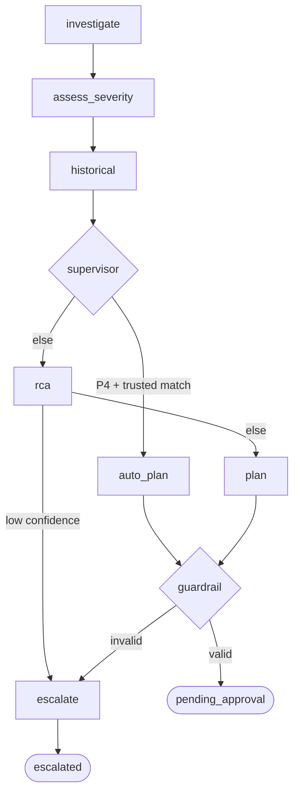
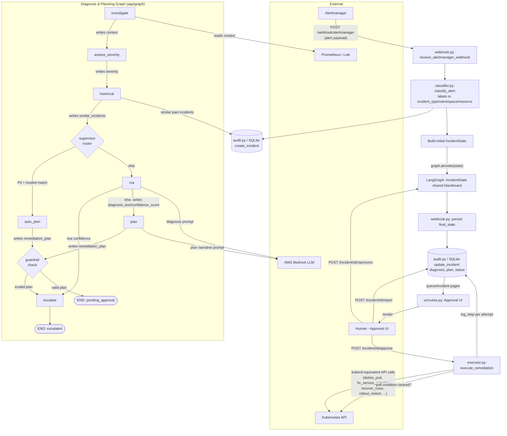

# Agent Architecture: Data Flow & State Sharing

## How it actually works (important framing first)

This isn't a multi-agent "conversation" system (no agent-to-agent messaging/chat). It's a
**single LangGraph state machine** (`agent/app/graph/graph.py`) where all "agents" are really
**nodes that read/write a shared `IncidentState` dict** (a blackboard pattern), invoked
sequentially/conditionally by one orchestrator (`graph.ainvoke(...)`). Only one node (`rca`,
and optionally `plan`) actually calls an LLM (Bedrock). Everything else is deterministic Python
(rules, DB lookups, template lookups).

## Simple internal-only DFD (nodes only, no external systems)

## Nodes ("agents") and what triggers them

| Node | File | Trigger (edge) | Reads from state | Writes to state |
|---|---|---|---|---|
| **investigate** | `agent/app/graph/nodes/investigate.py` | `START` (always first) | `incident_type`, `namespace`, `resource_name`, `raw_alert`, `labels` | `context` (Prometheus/Loki evidence) |
| **assess_severity** | `agent/app/graph/nodes/severity.py` | after `investigate` | `incident_type`, `context`, `alert_severity` | `severity` (P1-P4), `severity_rationale` |
| **historical** | `agent/app/graph/nodes/historical.py` | after `assess_severity` | `incident_type`, `incident_id`, `resource_name`, `severity` | `similar_incidents` (scored past resolved incidents from `audit.py`/SQLite) |
| **supervisor** | `agent/app/graph/nodes/supervisor.py` | after `historical` | `severity`, `similar_incidents` | *(no-op node; routing only)* |
| → routes to **auto_plan** | | if severity==P4 AND a same-resource historical match with similarity ≥0.7 exists | | |
| → routes to **rca** | | otherwise | | |
| **auto_plan** | `agent/app/graph/nodes/auto_plan.py` | supervisor route | `similar_incidents`, `namespace`, `resource_name` | `remediation_plan`, `diagnosis_text`, `confidence_score`, `low_confidence=False` |
| **rca** | `agent/app/graph/nodes/rca.py` | supervisor route | `incident_id`, `incident_type`, `raw_alert`, `context` → calls **Bedrock LLM** (`bedrock_client.generate_diagnosis`) | `diagnosis_text`, `confidence_score`, `low_confidence`, `escalation_reason` (if low confidence) |
| → routes to **escalate** | | if `low_confidence` (<0.4) | | |
| → routes to **plan** | | otherwise | | |
| **plan** | `agent/app/graph/nodes/plan.py` | rca route | `incident_type`, `diagnosis_text`, `confidence_score`, `severity`, `context` → calls **Bedrock LLM** for narrative only | `remediation_plan` (action always from the fixed allow-list in `remediation/templates.py`, never from the LLM unless `llm_authors_action` is on and it matches) |
| **guardrail** | `agent/app/graph/nodes/guardrail.py` → `agent/app/graph/guardrail.py` | after `auto_plan` OR `plan` (converge) | `remediation_plan`, `incident_type`, `namespace`, `resource_name` | `escalation_reason` if the plan's action/target don't match the allow-list/alert |
| → routes to **escalate** | | guardrail rejects | | |
| → routes to **END** | | plan passes → becomes `pending_approval` | | |
| **escalate** | `agent/app/graph/nodes/escalate.py` | from rca or guardrail | `escalation_reason` | `escalation_reason` (finalized) → **END** |

## Data Flow Diagram

## What triggers what, and exactly what's passed

1. **Alertmanager → webhook.py**: HTTP POST with `{status, labels, annotations, fingerprint}` per alert.
2. **webhook.py → classifier.py**: raw alert labels in, `ClassifiedAlert(incident_type, namespace, resource_name, severity, labels, annotations)` out.
3. **webhook.py → audit.py**: creates a DB row, gets back `incident_id`.
4. **webhook.py → graph.ainvoke**: builds the **initial `IncidentState`** (`incident_id`, `incident_type`, `namespace`, `resource_name`, `alert_severity`, `labels`, `annotations`, `raw_alert`) — this is the *entire* payload handed to the graph. Every node after that only ever returns a **partial dict** that LangGraph merges into this same shared state (nodes never call each other directly or pass custom messages — they just read whatever keys previous nodes filled in).
5. **investigate → severity → historical → supervisor**: each strictly reads keys the prior node wrote (`context` → `severity` → `similar_incidents`) — a linear evidence-gathering chain, always run in full regardless of incident type.
6. **supervisor's routing function** (`route_after_supervisor`) is the first fork: pure function of `severity` + `similar_incidents`, decides `auto_plan` vs `rca`.
7. **rca ↔ Bedrock**: sends `incident_type`, `raw_alert`, `context` (+ similar incidents via prompt grounding) to Bedrock; gets back free text parsed into `Diagnosis(text, confidence)`.
8. **rca's routing function** (`route_after_rca`): forks to `escalate` (if `confidence_score < 0.4`) or `plan`.
9. **plan ↔ Bedrock**: sends diagnosis/severity/context to Bedrock for **narrative only**; the `action` field is always cross-checked/forced against `remediation/templates.py`'s single allow-listed action per `incident_type` — the LLM cannot choose an arbitrary action.
10. **auto_plan / plan → guardrail**: both converge here; guardrail re-validates `remediation_plan.action` against the same allow-list and `remediation_plan.target` against the alert's real `namespace`/`resource_name` — defense in depth even for the LLM-authored path.
11. **guardrail's routing function**: forks to `escalate` or `END`.
12. **Graph → webhook.py**: `final_state` (whatever keys got filled) is persisted back to the audit DB (`diagnosis_text`, `confidence_score`, `severity`, and either `escalation_reason` → status `escalated`, or `remediation_plan` → status `pending`/`pending_approval`).
13. **Human (UI) → executor.py**: only on `/incident/{id}/approve` does anything touch the real cluster. Passes `plan` (with its fixed `action` + `target`) to `execute_remediation`, which dispatches to the one handler for that action (`delete_pod`, `recover_node`, `fix_service_selector`, `delete_blocking_networkpolicy`, `rollout_restart_deployment`), polls up to `MAX_ATTEMPTS=60` × `5s` until the underlying Prometheus-style condition clears, and streams `on_update(status, result)` back into `audit.py` after every attempt (so the UI shows live progress).
14. **Human → reject**: just flips status, no further trigger.
15. **Human → reprocess**: re-invokes the **same graph** from scratch with a freshly rebuilt `IncidentState` (only for `escalated` incidents) — same triggers as step 4 onward.

## Key architectural point worth calling out
There is **no peer-to-peer agent communication** — state only ever flows one direction, node → shared dict → next node, controlled entirely by `graph.py`'s edges and two routing functions (`route_after_supervisor`, `route_after_rca`, `route_after_guardrail`). The only non-deterministic ("agentic") components are the two Bedrock calls in `rca` and `plan`; every routing decision and the final remediation action are deterministic Python, which is the safety design documented in the guardrail/templates docstrings.
