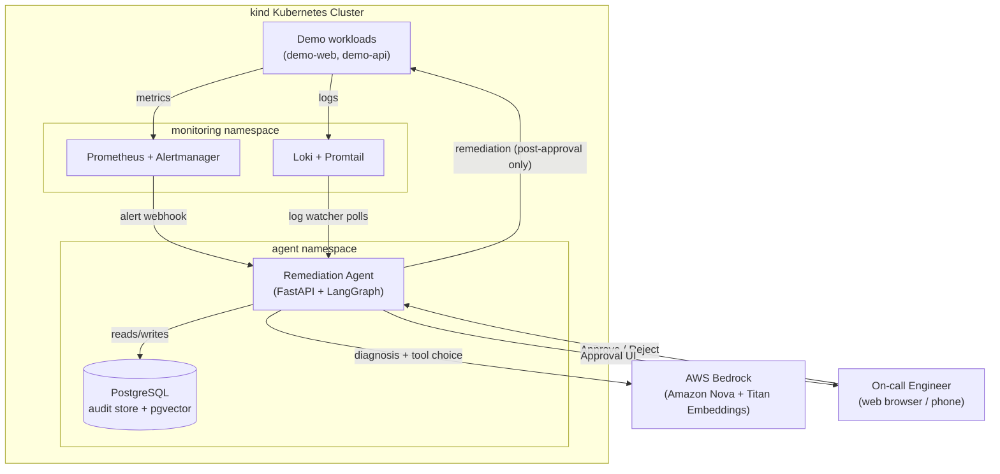
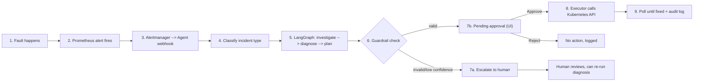
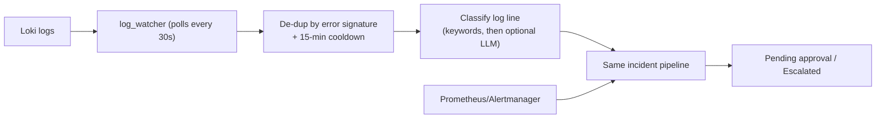
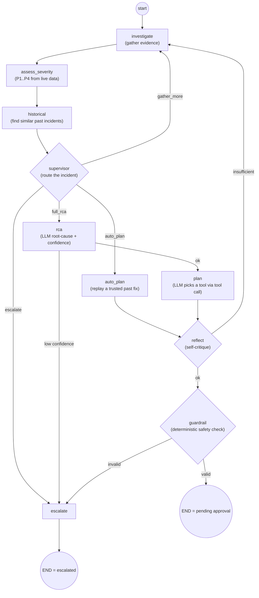
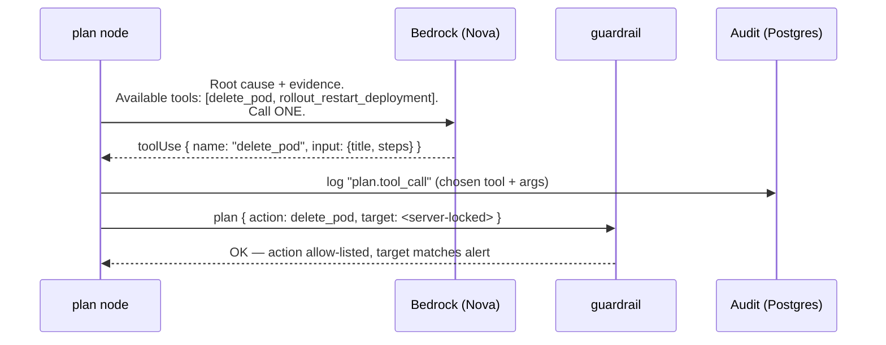
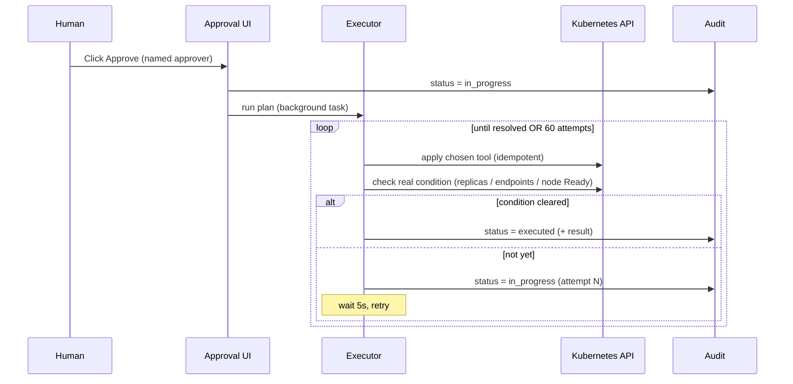
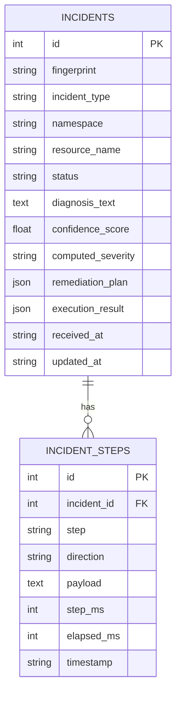

# Capstart — AI-Powered Kubernetes Incident Remediation Agent
### Project Presentation

---

## 1. Executive Summary

**Capstart** is a human-in-the-loop AI agent that watches a live Kubernetes cluster,
detects operational incidents the moment they happen, diagnoses the root cause with
a Large Language Model (AWS Bedrock / Amazon Nova), proposes a fix, and **only touches
the cluster after a human clicks Approve**.

> **One-line pitch:** *"It gives every on-call engineer a senior SRE sitting next to
> them — one that never sleeps, reads every log and metric instantly, and always
> asks permission before touching production."*

| | |
|---|---|
| **Problem** | Kubernetes incidents are frequent, repetitive, and time-critical. Manual triage is slow; fully autonomous "self-healing" is too risky for production. |
| **Solution** | An LLM-assisted diagnosis + planning pipeline, constrained by deterministic guardrails and a mandatory human approval gate. |
| **Outcome** | Diagnosis time drops from minutes to seconds; every remediation is explainable, auditable, and reversible-by-design; humans stay in control. |

---

## 2. The Business Problem

### 2.1 Why this matters to a real organization

| Pain point today | Cost to the business |
|---|---|
| On-call engineer paged at 2 AM for a crash-looping pod | Burnout, slow response, human error under pressure |
| Root-causing an incident means manually cross-referencing Grafana, `kubectl describe`, and log search | 10–30 minutes of **Mean Time To Diagnose (MTTD)** per incident, even for "well-known" failure patterns |
| Junior engineers don't have the tribal knowledge senior SREs have | Inconsistent fixes, repeated mistakes, knowledge walks out the door when people leave |
| Fully automated "self-healing" tools exist, but most teams **don't trust them** in production | Either nobody turns them on, or they get turned off after one bad auto-action |
| No searchable record of "what did we do last time this happened?" | Repeated investigation of already-solved problems |

### 2.2 Real-time business scenarios this solves

- **E-commerce platform, Black Friday traffic spike:** a checkout microservice pod
  starts crash-looping under load. Instead of paging an engineer who has to
  SSH-dig through logs while revenue bleeds every minute, Capstart detects it in
  under 15 seconds, has a diagnosis and a proposed fix ready in Slack/UI before
  the human even opens their laptop. **Approval takes one click.**
- **FinTech company, regulated environment:** a compliance mandate says *"no
  automated system may modify production without a human decision recorded."*
  Capstart's audit trail (every query, every LLM call, every approval) **is** that
  compliance record — the AI accelerates, the human stays accountable.
- **SaaS startup, small SRE team (2 people covering 24/7):** on-call fatigue is
  the #1 attrition risk. Capstart absorbs the "triage legwork" (70% of the time
  spent on any incident), so the human's job shrinks to *"read the summary,
  click Approve."*
- **Enterprise with strict change-management (ITIL/SOX):** every production
  change needs a named approver and a reason. Capstart's `approver` field and
  diagnosis narrative satisfy that out of the box — no extra paperwork.

### 2.3 Why not "fully autonomous self-healing"?

Industry AIOps tools often promise full automation. In practice, most enterprises
**reject** this because:
- A hallucinated or mis-scoped action (`kubectl delete` on the wrong namespace) is
  a career-ending/production-ending event.
- Regulators and auditors require a named human decision for production changes.
- Trust is earned gradually — teams want to see the AI's reasoning before letting
  it act unsupervised.

**Capstart's answer:** *"Fast like automation, safe like a human."* The AI does
100% of the thinking; a deterministic allow-list and a human click gate 100% of
the acting.

---

## 3. Technology Stack

| Layer | Technology | Why this choice |
|---|---|---|
| **Cluster** | `kind` (Kubernetes-in-Docker), 1 control-plane + 2 workers | Reproducible, laptop-friendly, identical API to real EKS/GKE/AKS clusters |
| **Metrics & Alerting** | Prometheus, Alertmanager, kube-state-metrics, node-exporter, blackbox-exporter | Industry-standard observability stack already used by most K8s shops |
| **Logs** | Loki + Promtail | Lightweight, Prometheus-style log aggregation (no heavyweight ELK needed) |
| **Agent runtime** | Python 3, **FastAPI** | Async-first web framework, ideal for webhook + background task execution |
| **Orchestration / reasoning** | **LangGraph** (stateful graph of AI + rule-based nodes) | Explicit, inspectable state machine — not a black-box agent loop |
| **LLM** | **AWS Bedrock — Amazon Nova** (`nova-pro`, `nova-lite`, Titan embeddings) | Enterprise-grade, private (no public internet round-trip), pay-per-use, tool-calling support |
| **Vector search (optional)** | pgvector (PostgreSQL extension) | Hybrid keyword + semantic similarity search over historical incidents |
| **Kubernetes control** | Official Kubernetes Python client | Only invoked **after** human approval |
| **Audit store** | PostgreSQL | Durable, queryable, survives agent restarts |
| **Approval UI** | FastAPI + HTML/HTMX | Zero build step, server-rendered, fast to review on a phone during an on-call page |
| **Fault injection (demo only)** | Standalone Python scripts (`injector/`) | Deliberately decoupled from the agent so injected faults are never confused with agent-caused state |
| **Containerization** | Docker | Agent ships as a container, deployed via Kubernetes manifests |
| **Infra automation** | PowerShell scripts (`deploy.ps1`, `inject.ps1`, `status.ps1`, `teardown.ps1`) | One-command demo environment stand-up/tear-down |

---

## 4. System Architecture



---

## 5. The Detailed End-to-End Flow

### 5.1 High-level lifecycle



### 5.2 Step-by-step narrative (what actually happens)

| # | Stage | Detail | Situation example |
|---|---|---|---|
| 1 | **Fault happens** | Something breaks for real: bad deploy, node failure, misconfigured network rule | A developer ships a deployment with a typo'd image tag |
| 2 | **Detection** | Prometheus continuously scrapes metrics; a rule crosses its threshold (e.g. `increase(restarts[5m]) > 3`) | `PodCrashLoopBackOff` rule fires after 3 restarts in 5 minutes |
| 3 | **Alert delivery** | Alertmanager groups/dedupes and POSTs a webhook to the agent | `POST /webhook/alertmanager` with full alert payload (labels, annotations, fingerprint) |
| 4 | **Classification** | Deterministic rule engine maps alert labels → one of 5 known incident types + namespace + resource name | `DeploymentReplicaMismatch` → `incident_type=replica_mismatch`, `namespace=demo`, `resource=demo-api` |
| 5 | **Incident created** | A row is written to PostgreSQL, `status=pending` — now trackable, auditable, de-duplicated | Repeated alerts for the same still-pending incident are ignored (no duplicate noise) |
| 6 | **Investigate** | Agent pulls live PromQL/LogQL evidence (restart counts, replica gaps, recent logs); optionally a ReAct loop calls read-only tools (`get_pod`, `list_events`, `describe_deployment`) for deeper context | "Pod `demo-web-xyz` restarted 7 times in 5 min, exit code 1, log shows `echo boom; exit 1`" |
| 7 | **Severity scoring** | Deterministic heuristics compute P1–P4 from real numbers — no AI guesswork for "how bad is this" | Full outage (0 available replicas) → P1; partial degradation → P3 |
| 8 | **Historical lookup** | Searches past resolved incidents (keyword + optional pgvector semantic similarity) for a trusted precedent | "This exact failure signature was seen and fixed 3 days ago with `delete_pod`" |
| 9 | **Supervisor routing** | Decides: replay a known-good fix (`auto_plan`), run full reasoning (`full_rca`), gather more evidence, or escalate immediately — LLM-assisted but rule-backstopped | A near-identical historical match with high confidence → skip straight to `auto_plan`, save an LLM call |
| 10 | **Root-cause analysis (RCA)** | Bedrock (Nova) writes a plain-English diagnosis + a confidence score (0.0–1.0) | *"The container exits immediately due to a deliberately broken start command, causing the restart counter to spike."* confidence=0.92 |
| 11 | **Low-confidence guard** | If confidence < 0.4, skip planning entirely and escalate | Ambiguous/novel failure the LLM isn't sure about → goes straight to a human, no guesswork action proposed |
| 12 | **Plan authoring (tool call)** | Bedrock is offered the **allow-listed** remediation tools for this incident type as callable functions, and must **call one** (not describe one) | Offered `delete_pod` + `rollout_restart_deployment` → calls `delete_pod` with a generated title/steps |
| 13 | **Self-reflection (optional)** | A second LLM pass critiques the plan against the evidence; if unsupported, loops back to gather more data (capped) | "Plan assumes 3 replicas but evidence shows 2 — gather more" → one more investigate pass |
| 14 | **Guardrail (deterministic, no AI)** | Confirms the action is in the allow-list for this incident type AND the target namespace/resource exactly matches the real alert | A hypothetically hallucinated target (`namespace=kube-system`) would be **rejected here**, regardless of what the LLM said |
| 15 | **Human approval gate** | Plan appears in the web UI queue with full diagnosis, evidence, and reasoning trace | On-call engineer opens the link from a Slack/Teams notification, reads a 3-sentence summary, clicks **Approve** |
| 16 | **Execution** | Executor dispatches the approved tool against the real Kubernetes API, then **polls the same signal Prometheus alerts on** until it clears (up to 60 attempts × 5s) | Deletes the crash-looping pod → waits for the new pod to reach `Running` → confirms restart count stops climbing |
| 17 | **Audit + resolution** | Every query, prompt, tool call, and API call is permanently logged; incident status becomes `executed`; Alertmanager's "resolved" webhook later confirms closure | Full replayable timeline visible on the incident detail page — useful for postmortems and compliance audits |

### 5.3 The "two front doors" — multiple ways an incident can start



Business situation: not every failure trips a clean metric alert first. A
service might log `FATAL: connection refused` seconds before replica counts
visibly drop. The log-driven front door catches that earlier signal too —
giving the business a **head start** on incidents that would otherwise surface
minutes later via pure metrics.

---

## 6. The Reasoning Pipeline (LangGraph) — Visualized



**Key principle — "narrow or defer, never widen":** at every AI decision point
(supervisor routing, RCA confidence, reflection, plan tool choice), the LLM can
only make the system **more cautious** (ask for more evidence, lower confidence,
escalate to a human) — it can **never** expand the set of actions available or
bypass the guardrail/approval gate.

---

## 7. How the LLM Chooses a Fix — Tool-Calling, Not Free Text



**Business translation:** this is the difference between asking an AI to
*"type a command"* (dangerous — it could type anything) versus asking it to
*"press one of these five labeled buttons"* (safe — the buttons are fixed,
audited, and reversible). Capstart only ever lets the AI press a button.

---

## 8. Approval & Execution — The Human-in-the-Loop Gate



Incident status lifecycle:

```
pending --(Approve)--> in_progress --> executed | execution_failed
pending --(Reject)---> rejected
pending --(graph escalates)--> escalated --(human re-runs diagnosis)--> pending
(Alertmanager says resolved) --> resolved
```

---

## 9. The Five MVP Incident Types — Real Business Scenarios

Each row below is a **realistic production situation**, how Capstart handles
it end-to-end, and the business impact of automating the triage.

### 9.1 Crash-looping pod (`crashloop`)

| | |
|---|---|
| **Real-world trigger** | A bad deploy ships a broken startup command/config; the container exits immediately and Kubernetes keeps restarting it. |
| **Detection** | `PodCrashLoopBackOff` — `increase(kube_pod_container_status_restarts_total[5m]) > 3` |
| **Evidence gathered** | Restart count, exit code, recent container logs from Loki |
| **LLM picks from** | `delete_pod`, `rollout_restart_deployment` |
| **What actually happens on approval** | Last-known-good command/image is restored (if the agent recorded it) and the pod is deleted so the ReplicaSet reschedules a healthy replica |
| **Business impact** | A checkout service that would otherwise 500-error for every customer for 10+ minutes recovers in under a minute, with a named human sign-off for the change log |

### 9.2 Node NotReady (`node_not_ready`)

| | |
|---|---|
| **Real-world trigger** | A worker node's kubelet crashes or the VM becomes unresponsive (cloud host issue, OOM at the OS level, etc.) |
| **Detection** | `NodeNotReady` — `kube_node_status_condition{condition="Ready"} == 0` |
| **Evidence gathered** | Node conditions, pods scheduled there, knock-on alerts (pods on that node losing endpoints) |
| **LLM picks from** | `recover_node` |
| **What actually happens on approval** | Node is cordoned (no new pods scheduled there) and polled until it reports `Ready` again, then automatically uncordoned |
| **Business impact** | Prevents a "death spiral" where new pods keep landing on a dying node; on-call doesn't have to manually babysit `kubectl get nodes -w` for 5+ minutes |

### 9.3 Service unreachable (`service_unreachable`)

| | |
|---|---|
| **Real-world trigger** | A config change or selector typo breaks a Service's label selector, so it stops matching any pods |
| **Detection** | `ServiceEndpointsUnreachable` — `kube_endpoint_address_available == 0` |
| **Evidence gathered** | Service spec vs pod labels, synthetic probe results |
| **LLM picks from** | `fix_service_selector` |
| **What actually happens on approval** | Service's selector is restored to the last-known-good value, Endpoints repopulate immediately |
| **Business impact** | An internal payments API that silently stopped receiving traffic (zero errors logged because nothing could even connect) is caught by an active probe instead of a customer complaint |

### 9.4 NetworkPolicy blocking traffic (`networkpolicy_block`)

| | |
|---|---|
| **Real-world trigger** | A security team or automated policy pushes an overly broad deny-all NetworkPolicy that accidentally blocks legitimate traffic |
| **Detection** | `NetworkPolicyBlockingTraffic` — synthetic blackbox probe fails (`probe_success == 0`) |
| **Evidence gathered** | Active NetworkPolicies in the namespace, probe failure history |
| **LLM picks from** | `delete_blocking_networkpolicy` |
| **What actually happens on approval** | The offending policy is identified and removed, traffic resumes |
| **Business impact** | Classic "it's always DNS... or a NetworkPolicy" outage resolved without a war-room bridge call and a dozen engineers independently running `kubectl get networkpolicy` |

### 9.5 Replica mismatch (`replica_mismatch`)

| | |
|---|---|
| **Real-world trigger** | A deployment is updated with a bad/nonexistent image tag; the rollout gets stuck with unavailable replicas |
| **Detection** | `DeploymentReplicaMismatch` — `kube_deployment_status_replicas_unavailable > 0` |
| **Evidence gathered** | Rollout status, pod events (`ImagePullBackOff`), deployment spec vs available replicas |
| **LLM picks from** | `rollout_restart_deployment`, `delete_pod` |
| **What actually happens on approval** | Last-known-good image is restored and a fresh rollout is triggered |
| **Business impact** | A bad CI/CD release that would otherwise need a manual rollback (often the slowest part of an incident) self-heals within one approval click |

---

## 10. Observed Real End-to-End Run (Incident #17)

A genuine run captured from the live demo cluster — this is what a reviewer
or stakeholder would actually see in the UI and audit log:

1. **Fault:** `demo-web`'s container command patched to crash on start.
2. **Alert:** `DeploymentReplicaMismatch` fires, Alertmanager posts the webhook.
3. **Classification:** `incident_type=replica_mismatch`, incident **#17** created (`status=pending`).
4. **Pipeline:** 5× Prometheus queries + 1 Loki query → investigate summary →
   supervisor chose `full_rca` → 3 similar historical incidents retrieved →
   Bedrock diagnosis, **confidence=0.8** → plan node offered 2 tools, LLM
   **called** `rollout_restart_deployment` → reflection passed → guardrail passed.
5. **Human approval:** `POST /incident/17/approve`, approver recorded.
6. **Execution:** last-known-good image restored, rollout restart triggered,
   polled until `availableReplicas == specReplicas` — **resolved in attempt 1,
   under 5 seconds.**
7. **Verification:** both pods `Running`, Prometheus alert subsequently resolved.

> **Takeaway for stakeholders:** this was not a scripted demo response — the
> plan's title and steps were generated fresh by the LLM from the live
> evidence, and independently validated by the deterministic guardrail before
> any human saw it.

---

## 11. Safety Architecture — "Why This Won't Delete Production"

Three pillars, enforced by three completely separate, independently-verifiable
mechanisms:

| Pillar | Mechanism | What it prevents |
|---|---|---|
| **1. No free-form actions** | The LLM can only *call* one of a handful of pre-registered functions (`delete_pod`, `rollout_restart_deployment`, `fix_service_selector`, `delete_blocking_networkpolicy`, `recover_node`) — never write a shell command | A hallucinated or injected instruction (e.g. from untrusted log text) cannot result in an arbitrary cluster-wide command |
| **2. Deterministic guardrail** | A non-AI, rule-based check re-validates: *(a)* the action is allow-listed for this incident type, *(b)* the target namespace/resource exactly matches the original alert (server-injected, never LLM-supplied) | Even a compromised/confused LLM output targeting the wrong namespace is rejected before a human ever sees it |
| **3. Mandatory human approval** | Zero code paths execute anything without an explicit, named `Approve` click — regardless of confidence score | Guarantees a human decision-maker of record for every production change (audit/compliance requirement in most regulated industries) |

Additional defense-in-depth:
- **Prompt-injection resistance:** every prompt explicitly marks untrusted log/metric
  text and instructs the model to never follow instructions embedded inside it.
- **Idempotent, retried remediation:** fixes are safe to re-apply; the executor
  keeps re-checking the *actual* condition (not just "did the API call succeed")
  until it's genuinely resolved or a retry budget is exhausted.
- **Least-privilege RBAC:** the agent's Kubernetes service account can read broadly
  but can only mutate the specific resource kinds its five tools need.
- **Full audit trail:** every external call (Prometheus, Loki, Bedrock, Kubernetes
  API) is logged per-incident in PostgreSQL and survives agent restarts.

---

## 12. Data & Audit Model



Every incident is a complete, replayable story: what alert fired, what
evidence was gathered, what the AI concluded, what it proposed, who approved
it, and what actually happened — queryable months later for a postmortem or
an audit.

---

## 13. Business Value Summary

| Metric | Manual process | With Capstart |
|---|---|---|
| **Time to diagnosis** | Minutes (cross-referencing dashboards, logs, `kubectl`) | Seconds (automated evidence gathering + LLM synthesis) |
| **Consistency** | Varies by engineer's experience/tribal knowledge | Same rigorous evidence-gathering + allow-listed fixes every time |
| **Decision accountability** | Verbal/Slack "I did X" | Structured, timestamped, named-approver audit record |
| **Knowledge retention** | Walks out the door when senior engineers leave | Captured in historical-incident matching + auditable diagnoses |
| **Risk of a bad automated action** | N/A (nothing automated) | Bounded by a fixed allow-list + guardrail + mandatory approval — never zero-trust automation |
| **On-call cognitive load** | High — read everything, decide everything | Low — read a summary, click Approve/Reject |

---

## 14. Current Scope & Honest Limitations

- **5 incident types** fully implemented end-to-end (crash loops, node failure,
  service unreachability, NetworkPolicy blocks, replica mismatches). A documented
  stretch list exists (OOMKilled, Pending pods, disk pressure, config errors,
  control-plane latency) for future expansion.
- **Single-cluster, single-tenant** — no multi-cluster fan-in or per-team RBAC yet.
- **Historical matching** is similarity-based (keyword + optional vector search),
  not a fully autonomous memory system.
- Demo runs on a local `kind` cluster; the same container/manifests are
  structured to deploy to a real managed Kubernetes service (EKS/GKE/AKS) with
  no architectural changes.

---

## 15. Roadmap / What's Next

1. Expand the incident catalog (OOMKilled, Pending/unschedulable pods, disk pressure).
2. Multi-cluster support for organizations running several environments.
3. Deeper historical-memory (full RAG over resolved incidents) to make
   `auto_plan` replay smarter and safe at higher severities.
4. Native Slack/Teams approval action buttons (approve without leaving chat).
5. Pluggable LLM backend (swap Bedrock for Azure OpenAI / on-prem model) for
   organizations with different cloud commitments.

---

## 16. Closing Statement

Capstart demonstrates that **AI-accelerated operations and safe production
change management are not mutually exclusive.** The LLM does the hard,
time-consuming work of reading logs and metrics and forming a hypothesis; a
deterministic safety layer and a human's click do the only thing that
actually matters for trust — **deciding what touches production.**
